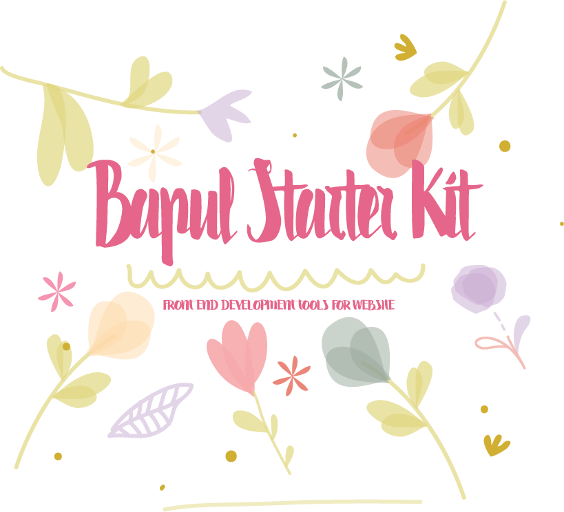

<div align="center"></div>

## ✿ Overview
__빠른 웹사이트 제작__을 위한 __Front-End 개발 도구__ 입니다.
기본적으로 [__Node__](https://nodejs.org/), [__NPM__](https://www.npmjs.com/), [__Gulp__](http://gulpjs.com/), [__Sass__](http://www.sass-lang.com/), [__Babel__](https://babeljs.io/)을 사용합니다.<br>

- __v1.x__: `node`, `npm`, `gulp`, `babel`, `sass`, `browserify` / `jQuery`, `angular1.x`


## ✿ Features
Feacture | Summary
---------|---------
실시간 웹 서버 테스트 환경 | `HTML`, `SASS`, `JS` 변경 내용을 실시간으로 확인하고 빌드합니다.
웹 개발 패키지 관리 | `bapul-starter-kit`은 `bower`와 `npm`을 따로 사용하지 않습니다. 통일성을 위해 `npm`만을 사용하여 관리합니다.
CSS 프리프로세싱 | 효과적인 유지보수를 위해 `Sass`를 사용합니다.
Front-End 환경에서의 모듈화 | 프런트 환경에서도 모듈관리를 할 수 있습니다.<br> 구조적은 폴더 구조를 설계함으로써 유지보수의 힘을 실어 줍니다.
이미지 최적화 | `JPG`, `GIF`, `PNG` 파일 크기를 최적화 합니다.
이미지 스프라이트 생성 | 브라우저에서 `Request` 수 를 줄이기 위해 이미지를 스프라이트 할 수 있습니다.<br>옵션을 통해 `sprite.png`, `sprite.scss` 파일을 자동으로 생성합니다.
문법 검사 | `Sass, JS` 문법 검사를 하여 개발의 편리성을 제공합니다.
파일 압축 | 웹사이트 최적화를 위해 코드 압축을 도와줍니다.
폰트 아이콘 생성 | `SVG` 파일을 폰트로 자동 생성합니다.
ES2015(ES6) | 최신 자바스크립트 버전인 ES2015를 지원합니다.
웹 앱 | 모바일 웹 앱을 지원합니다.
웹브라우저 파일 캐쉬 | 파일 캐쉬를 통하여 웹사이트 속도 개선합니다.


## ✿ Dependent Modules
- __유틸리티(Utillities)__
  - [del](https://github.com/sindresorhus/del) - 폴더 및 파일 제거
  - [gulp](https://github.com/gulpjs/gulp) - 스트리밍 업무별 빌드 시스템
  - [gulp-cache](https://github.com/jgable/gulp-cache) - 임시 파일 기반 캐싱 프록시 작업
  - [gulp-concat](https://github.com/contra/gulp-concat) - 파일 병합
  - [gulp-filter](https://github.com/sindresorhus/gulp-filter) - 파일 확장자로 필터링
  - [gulp-if](https://github.com/robrich/gulp-if) - 조건에 따른 업무 처리
  - [gulp-load-plugins](https://github.com/jackfranklin/gulp-load-plugins) - `package.json` 파일을 읽어 플러그인 호출
  - [gulp-print](https://github.com/alexgorbatchev/gulp-print) - 파일의 이름을 출력
  - [gulp-size](https://github.com/sindresorhus/gulp-size) - 업무 처리 결과 파일 크기를 출력
  - [gulp-sourcemaps](https://github.com/floridoo/gulp-sourcemaps) - 개발용 소스맵(`Sourcemap`) 생성
  - [gulp-util](https://github.com/gulpjs/gulp-util) - `Gulp` 유틸리티
  - [lodash.assign](https://github.com/lodash/lodash) - 모듈화, 성능 등을 제공하는 자바스크립트 유틸리티 라이브러리
  - [merge-stream](https://github.com/grncdr/merge-stream) - 다중 스트림을 하나의 스트림으로 변환
  - [run-sequence](https://github.com/OverZealous/run-sequence) - 정해진 순서에 따라 업무 실행
  - [sw-precache](https://github.com/googlechrome/sw-precache) - 특정 자원을 미리 캐쉬
  - [sw-toolbox](https://github.com/GoogleChrome/sw-toolbox) - `Service Worker` 컬렉션
  - [vinyl-buffer](https://github.com/hughsk/vinyl-buffer) - 버퍼를 스트리밍 파일로 변환
  - [vinyl-source-stream](https://github.com/hughsk/vinyl-source-stream) - 기존 텍스트를 스트림으로
  - [watchify](https://github.com/substack/watchify) - `browserify`에 대한 감시 모드
- __웹 서버(Web Server)__
  - [browser-sync](https://github.com/browsersync/browser-sync) - 디바이스 별 실시간 테스트 웹서버 제공
- __프리프로세싱(Preprocessing) & 컴파일(Compile)__
  - [babel-core](https://github.com/babel/babel/tree/master/packages/babel-core) - `Babel` 기본 컴파일 도구
  - [babel-preset-es2015](https://github.com/babel/babel/tree/master/packages/babel-preset-es2015) - `ES2015` 플러그인에 대한 바벨
  - [babelify](https://github.com/babel/babelify) - `babel` 변환을 위한 `browserify`
  - [browserify](https://github.com/substack/node-browserify) - 클라이언트 환경에서의 모듈화 제공
  - [gulp-sass](https://github.com/dlmanning/gulp-sass) - `Sass` -> `CSS` 변환
- __CSS 브라우저 벤더 프리픽스(Browser Vendor Prefix)__
  - [gulp-autoprefixer](https://github.com/sindresorhus/gulp-autoprefixer) - Prefix `CSS`
- __문법 검사(Validation Syntax)__
  - [jshint](https://github.com/jshint/jshint) - 자바스크립트 코드 문법 검사
  - [jshint-stylish](https://github.com/sindresorhus/jshint-stylish) - `JSHint`를 위한 세련된 스타일 제공
  - [gulp-jscs](https://github.com/jscs-dev/gulp-jscs) - 자바스크립트 코드 스타일 확인
  - [gulp-jshint](https://github.com/spalger/gulp-jshint) - `Gulp`를 위한 `JSHint` 플러그인
  - [gulp-sass-lint](https://github.com/sasstools/gulp-sass-lint) - `Sass` 문법 검사
- __압축(Compress)__
  - [gulp-htmlmin](https://github.com/jonschlinkert/gulp-htmlmin) - `HTML` 압축
  - [gulp-uglify](https://github.com/terinjokes/gulp-uglify) - `JS` 압축
- __문서화(Documentation)__
  - [sassdoc](https://github.com/SassDoc/sassdoc) - Sass 문서화
- __이미지 최적화(Optimization)__
  - [gulp-imagemin](https://github.com/sindresorhus/gulp-imagemin) - `PNG`, `JPEG`, `GIF` 및 `SVG` 이미지를 압축
  - [imagemin-pngquant](https://github.com/imagemin/imagemin-pngquant) - `imagemin`을 위한 최적화 플러그인
- __이미지 스프라이트(Sprites) 및 아이콘폰트(Iconfont)__
  - [gulp-iconfont](https://github.com/nfroidure/gulp-iconfont) - 여러 SVG 아이콘을 이용하여 아이콘 글꼴 만들기
  - [gulp-iconfont-css](https://github.com/backflip/gulp-iconfont-css) - `iconfont`로 글꼴을 만들 때 `SCSS` 또는 `CSS`를 만들어 주는 플러그인
  - [gulp.spritesmith](https://github.com/twolfson/gulp.spritesmith) - 스프라이트 이미지 및 CSS 변수를 만들어주는 세트
  - [gulp-svg-sprite](https://github.com/jkphl/gulp-svg-sprite) - SVG 스프라이트
  - [gulp-svg2ttf](https://github.com/nfroidure/gulp-svg2ttf) - SVG 글꼴에서 TTF 글꼴 만들기
  - [gulp-svgicons2svgfont](https://github.com/nfroidure/gulp-svgicons2svgfont) - 하나의 글꼴에 여러 SVG를 번들
  - [gulp-ttf2eot](https://github.com/nfroidure/gulp-ttf2eot) - TTF 글꼴에서 EOF 글꼴 만들기
  - [gulp-ttf2woff](https://github.com/nfroidure/gulp-ttf2woff) - TTF 글꼴에서 WOFF 글꼴 만들기
  - [gulp-ttf2woff2](https://github.com/nfroidure/gulp-ttf2woff2) - TTF 글꼴에서 WOFF2 글꼴 만들기


## ✿ Installation & Version
```sh
  node -version  # Nodejs 설치 및 버전 확인
  npm -version  # NPM 버전 확인
  npm install -g gulp  # Gulp Global 설치
  npm install  # package.json 모듈 설치
```


## ✿ Requirements
- [Node](http://nodejs.org/) >=4.4.3
- [NPM](https://www.npmjs.com/) >=2.15.1
- [Sass](http://sass-lang.com/) >= 3.4.2


## ✿ Gulp Tasks
- __기본 업무__
```sh
  gulp  # Gulp의 모든 업무를 수행 (clean 제외)
```
- __삭제 업무__
```sh
  gulp clean  # 빌드(build)를 통해 생성되어지는 'dist'폴더를 삭제 합니다.
```
- __복사 업무__
```sh
  gulp copy  # 빌드 과정이 필요없는 파일들을 배포 폴더로 복사합니다.
  gulp copy:font  # 폰트 파일을 배포 폴더로 복사합니다.
  gulp copy:sw-scripts  # Service-Worker 관련 파일들을 배포 폴더로 복사합니다.
```
- __서버 업무__
```sh
  gulp serve  # 웹 서버 가동 및 HTML, SASS, JS 파일들을 관찰하여 자동 반영합니다.
```
- __뷰 업무__
```sh
  gulp views  # HTML파일들을 옵션을 통해 이동 및 압축을 합니다.
```
- __스타일 업무__
```sh
  gulp styles  # Sass 빌드
  gulp styles:lint  # Sass 문법 검사
```
- __스크립트 업무__
```sh
  gulp scripts  # JS 빌드
  gulp scripts:lint  # JS 문법 검사
```
- __이미지 업무__
```sh
  gulp images  # 이미지 최적화
```
- __이미지 스프라이트 업무__
```sh
  gulp sprite  # 이미지 스프라이트
```
- __아이콘 폰트 생성 업무__
```sh
  gulp iconfont  # SVG 아이콘을 폰트화
```
- __파일 캐쉬 및 오프라인 설정 업무__
```sh
  gulp generate-service-worker  # 파일 캐쉬
```


## ✿ Browser Support
- Chrome
- Edge
- Firefox
- Safari
- Opera
- Internet Explorer 10+


## ✿ License
Copyright © 2016 [Bapul](https://about.bapul.net) Inc.
